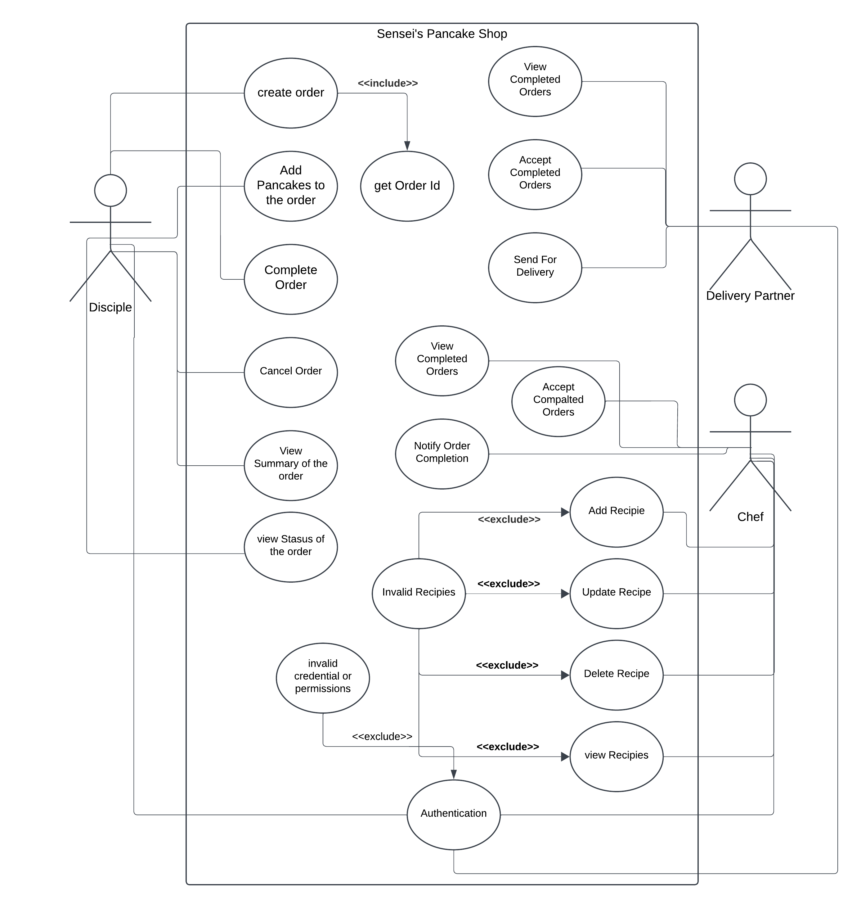
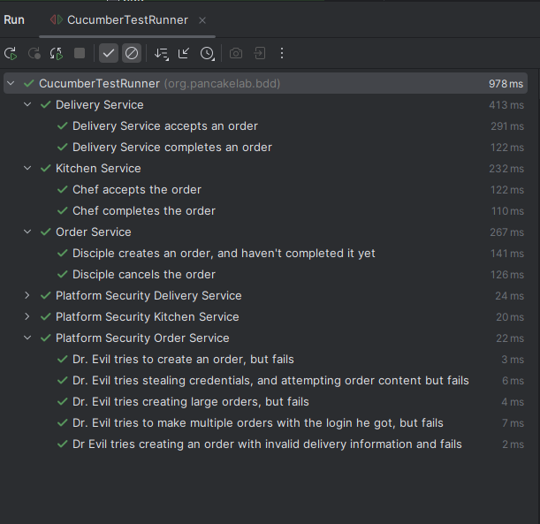

## Introduction
This project is designed and developed to facilitate a pancake shop is managed by Sensei.

## Design
Initially a use-case diagram was created to understand the requirements of the project and then
based on the identified entities, use-cases and security requirements the design was created.

## Development
The project followed TDD and BDD practices to develop features and then  to test and verify
the functionalities of them BDD Cucumber testing used, which can be run using class in the
test resource called `CucumberTestRunner.java`

## Testing
Unit Tests, Integration Tests and BDD Cucumber Tests were used to test the project.

## Security
As the project requirements and the scenarios that the older system was faced, identified
project was less secured and `Authentication` required to limit public access to the system required. However,
it was also identified that it was not enough, so that `Authorization` was also implemented. Decorator design pattern
used to wrap the original service to wrap with security of the services.

Usually, authorization is designed using JWT security claims using OAuth2, but for the simplicity the `User` class was
provided with the necessary permissions and the system is validating the claim.

Also, it is important that each system-user should not have the ability to see the all the information of the order. For
instant, the `KitchenService` user only see the Pancakes in the order and the `DeliveryService` user only see the delivery
information and the order ID.

## Performance

Then code is using `ExecutorService` in each service component to handle concurrency. Also, the most of the operations were
done in non-blocking manner even thought the system is not using `Reactive` programming. Events are passed through the
queues between services where the necessary pre-processing is done to minimize the latency as well.

### The Security claim pattern follows, following pattern

`Resource.Permissions` for example `order.CRUD` where it specifies the claim was given `order` resource access
and the `CRUD` (Create, Read, Update, Delete) permissions. According to the design a user can hold multiple
permissions for multiple resources like `order.CRUD,kitchen.CRUD,delivery.CRUD,recipe.CRUD` etc.